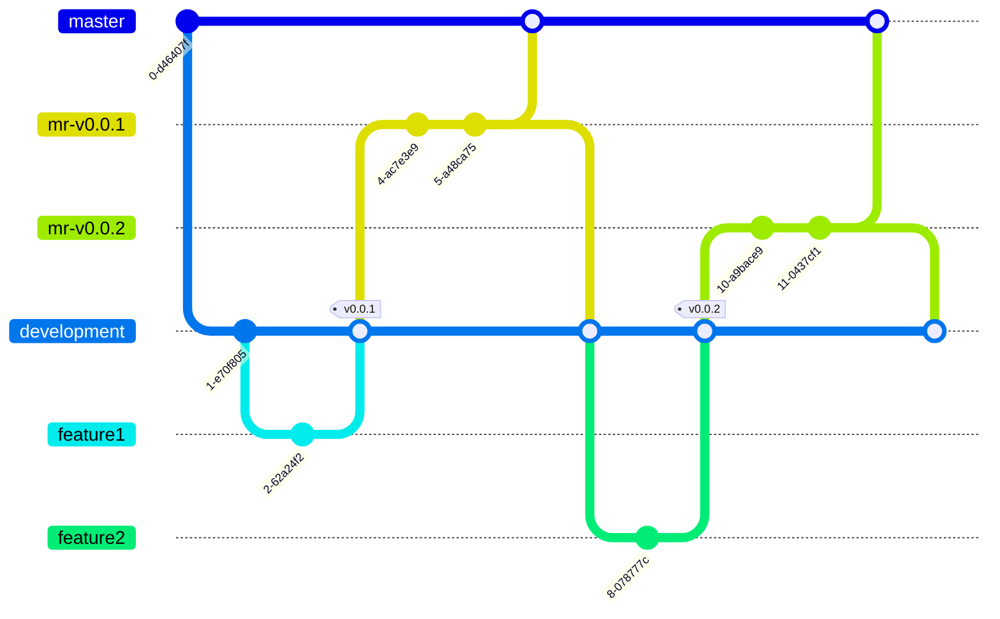

# Matrix Client

Mobile client for [Matrix](https://matrix.org)

## Build on Guix

in order to build on Guix, following dependencies need to be installed. 

- `json-modern-cxx`         
- `curl`                   
- `coeurl`                  
- `lmdb`                    
- `lmdbxx`                  
- `libolm`                  
- `matrix-client-library`
- `mtxclient`               
- `qtbase`                  `5.15.2`
- `qtquickcontrols2`        `5.15.2`
- `qtdeclarative`           `5.15.2`
- `qtsvg`                   `5.15.2`
- `spdlog-shared-lib`       

we also need to set following environment variables based on what set for `nheko` package:

```bash
cat ~/.guix-profile/bin/nheko
```

```bash
export QML2_IMPORT_PATH="..."
export QT_PLUGIN_PATH="..."
```

## Build 3rd party libraries

### Android

in order to build third-party libraries for Android, following dependencies need to be prepared:

1. Android SDK and NDK
    > after installing the Android SDK and NDK in order to have the command line access following variables need to be added to environment: 
    > ```bash
    > export ANDROID_HOME=$HOME/Android/Sdk
    > export ANDROID_SDK_ROOT=$HOME/Android/Sdk
    > export ANDROID_AVD_HOME=$HOME/.android/avd
    > export ANDROID_NDK=$ANDROID_HOME/ndk/23.1.7779620/
    > export PATH=$PATH:$ANDROID_HOME/emulator
    > export PATH=$PATH:$ANDROID_HOME/tools
    > export PATH=$PATH:$ANDROID_HOME/tools/bin
    > export PATH=$PATH:$ANDROID_HOME/platform-tools
    > export PATH=$PATH:$ANDROID_NDK
    > ```
2. Qt for Android
    > best way is to setup Qt from it's official net installer.

2. OpenSSL Library
    > prebuilt OpenSSL binaries for android can be fetched from [KDAB repository](https://github.com/KDAB/android_openssl). an easy way to set these libraries is to use Qt Creator:
    > 
    > `Tools` > `Options` > `Devices` > `Android` > `Android OpenSSL settings` > `Download OpenSSL`

Preparing the dependencies you need to run following command to build vendor libraries:
```shell
./vendor/build-android.sh all
```


### iOS

1. init submodules
    ```bash
    $ git submodule update --init
    ```

2. build openssl 
    ```bash
    $ bash ./vendor/setup_ios.sh openssl
    ```

3. build dependencies
    ```bash
    $ bash ./vendor/setup_ios.sh all
    ```

## Build for Android
since third-party libraries are not compatible with default NDK installed bt QtCreator, we need to setup custom Kit for our application. following steps describe how we can setup required configurations.

### Setup NDK 
install NDK `v23.23.1.7779620` using the SDK manager:

`Tools` > `Options` > `Devices` > `Android` > `SDK Manager` > `Tools`

**Note:** be aware the use same NDK version both for the application and third-party libraries.

### Prepare Compiler
installing the NDK, we need to add it manually to the list of compilers:

1. go to `Tools` > `Options` > `Kits` > `Compilers`
2. Clone default Clang C compiler: `Android Clang (C, arm, NDK 21.x.xxxxx)` and change it to the matching one for our installed NDK
3. Clone default Clang C++ compiler: `Android Clang (C++, arm, NDK 21.x.xxxxx)` and change it to the matching one for our installed NDK

### Setup Kit
in order to setup Kit:

1. go to `Tools` > `Options` > `Kits` > `Kits`
2. Clone default Android `5.15.x` Kit: `Android Qt %{Qt:Version} Clang Multi-Abi`
3. Set C and C++ compilers to the ones you created before


## Build for Linux

* Building the Application:

```bash
mkdir build
cd build
qmake ../MatrixClientApp.pro
```

* Building the Library:

```bash
mkdir build
cd build
qmake ../MatrixClientLib.pro
```

## Version release flow



in order to release new versions for the `MatrixClient` we follow below steps:

1. implement features in `feature` branches
2. submit merge requests to the `development` branch
3. after merge request approval, we need to update the mobile version before providing new tags:
    - Update the application version number in `/home/panther/repos/matrix-client/cpp/Application.h`.
    - for Android we need to modify `configurations/android/AndroidManifest.xml` file, updating the `android:versionName` and `android:versionCode`.
        - `android:versionCode` is an integer which should be incrementally increased for each release
        - `android:versionName` is the string value shows to the users. we need to set it to match with the tag we want to set
    - it's also recommended to update the `CHANGELOG.md` mentioning the changes applied on current version
4. committing the version related changes, now we can set the regarding tag on `development` branch.
5. in order to release new mobile APK:
   - create a branch from the `tag` we want to release APK based on, called `mr-vx.x.x`
   - submit a merge request from this branch to the `master` 
   - test the changes on mobile, apply fixes on mentioned branch
   - merge changes to `master` after we created the APK successfully
   - submit a merge-request to the `development` branch, to test new changes on desktop and make them available on future releases

- **Note 1:** If we have a recent change in the vendor dependencies like updating the library version, we need to both mention in the submitted merge request and apply the related change in the `vendor/build-android.sh` file.


## Android bundle release steps

in order to publish new signed bundle for android: 

1. open project in Qt Creator
2. in `Projects` > `Build` > `Build Steps` > `Build Android APK`
    - select proper keystore file to sign the APK with
    - provide the password for the keystore
    - select the `Build Android App bundle (*.aab)` option
- **Note:** release the bundle file, we need to increment the application version code, otherwise Google rejects the submitted bundle with the following message:
  > Version code XX has already been used. Try another version code.

following the above steps, we have the signed APK and bundle files. however since we updated the `ANDROID_TARGET_SDK_VERSION` to 30, we need to sign them manually with newer version of the signature schema than what supports by Qt Creator ( [reference](https://bugreports.qt.io/browse/QTBUG-91255?focusedCommentId=579924&page=com.atlassian.jira.plugin.system.issuetabpanels%3Acomment-tabpanel#comment-579924) ). 

- firt we need to adjust the archive file using the `zipalign` tool
  ```shell
  $ zipalign -v 4 "${file_path}" "${output_file}"
  ```
- then we sign the APK with a new version of signature schema using the `apksigner`
  ```shell
  $ apksigner sign --ks "${keystore_file}" --ks-key-alias "${keystore_alias}" --ks-pass "pass:${keystore_password}" --key-pass "pass:${key_password}" --verbose "${file_path}"
  ```
- later we can check the signature status using the following comand
  ```shell
  $ apksign verify --verbose "${file_path}"
  Verifies
  Verified using v1 scheme (JAR signing): true
  Verified using v2 scheme (APK Signature Scheme v2): true
  Verified using v3 scheme (APK Signature Scheme v3): true
  Verified using v4 scheme (APK Signature Scheme v4): false
  Verified for SourceStamp: false
  Number of signers: 1
  ```
- for the bundle file we use the `jarsigner` tool as bellow:
  ```shell
  $ jarsigner -verbose -sigalg SHA256withRSA -digestalg SHA-256 -keystore "${keystore_file}" "${file_path}" "${keystore_alias}" -storepass "${keystore_password}" -keypass "${key_password}"
  ```
- we can also strip the .aab signing if you want to replace it:
  ```shell
  $ zip -d "${file_path}" META-INF/\*
  ```
more info over here: https://source.android.com/security/apksigning